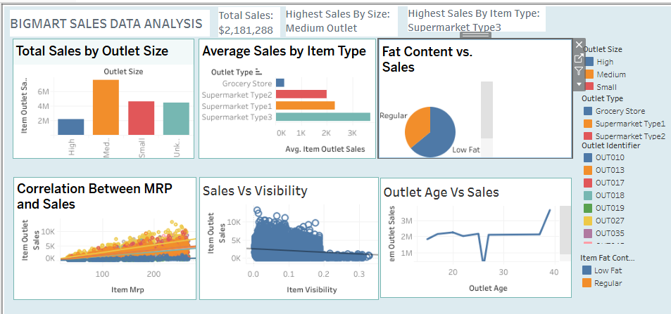

# PROJECT TITLE
## BIGMART DATA ANALYSIS
Using DATASET link provided by CONGNORISE INFOTECH , I analyzed sales trends and built an interactive Tableau dashboard to extract actionable insights.
## INTRODUCTION  
This project focuses on analyzing sales data from various outlets and products. 
## KEY OBJECTIVE:  
1. Cleaning and preprocessing the data using Excel.  
2. Creating visualizations using Tableau Public.  
3. Deriving insights and recommendations based on trends in the data.
## DATASET OVERVIEW 
- **Source**: [Kaggle BIGMART SALES DATA](https://www.kaggle.com/datasets/brijbhushannanda1979/bigmart-sales-data)  
- **Files**:  
  - `Train.csv`: Contains sales data for training.  
  - `Test.csv`: Reserved for prediction (if needed). 

#### FEATURES 
| Feature            | Description                             |  
|--------------------|-----------------------------------------|  
| `Item_Identifier`  | Unique product ID                      |  
| `Item_MRP`         | Maximum Retail Price of the item       |  
| `Outlet_Establishment_Year` | Year the outlet was established |  
| `Item_Outlet_Sales`| Total sales of the product in the store|  

## DATA CLEANING 
I I handled missing values, standardized entries, and derived new columns using Excel. 
## KEY STEPS:  
1. **Missing Values**: I filled missing values in numerical columns with averages and text columns with "Unknown".  
2. **Standardization**:I corrected inconsistent entries in `Item_Fat_Content` ("lf" → "Low Fat").  
3. **Derived Metrics**:i created a new column for outlet age.

## VISUALIZATION AND ANALYSIS  
### Tools:  
- **Excel**: For cleaning and preprocessing.  
- **Tableau Public**: For visualization and dashboard creation.  

### KEY FINDING:  
- **MRP vs. Sales**: High-MRP items contribute the most to revenue.  
- **Outlet Size and Sales**: Medium-sized outlets generate the most sales.  
- **Item Fat Content**: Low-fat items are more popular than regular-fat items.  
- **Outlet Type**: Supermarket Type 3 performs the best in sales.

## Tableau Dashboard  
The dashboard is interactive and allows users to filter by key metrics 
1. Sales by outlet type and size.  
2. Trends in sales over time.  
3. MRP vs. Sales insights.  

  

## Insights and Recommendations  
### Insights:  
1. Medium-sized outlets outperform others in sales.  
2. Low-fat items have higher sales than regular-fat items.  
3. Supermarket Type 3 is the leading sales contributor.  
4. Low-visibility items surprisingly outperform high-visibility items.  

### Recommendations:  
1. Expand medium-sized outlets for higher sales potential.  
2. Focus marketing efforts on low-fat items.  
3. Investigate and optimize product placement strategies for low-visibility items.  

